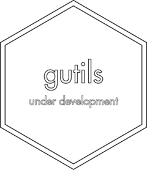

# rutils <a href = "https://danielvartan.github.io/brandr/"></a>

<!-- quarto render -->

<!-- badges: start -->
[](https://www.repostatus.org/#active)
[](https://github.com/danielvartan/rutils/actions)
[](https://app.codecov.io/gh/danielvartan/rutils)
[](https://choosealicense.com/licenses/mit/)
<!-- badges: end -->

## Overview

`rutils` is an R package that I (Daniel Vartanian) use to store and
organize my utility functions until they are ready to be moved to their
own package.

This package is primarily intended for personal use, but you are welcome
to use it if you find it helpful. Please note that not all functions are
exported or documented. Access the source code to see them all.

> If you find this project useful, please consider giving it a star!  
> [](https://github.com/danielvartan/rutils/)

## Installation

You can install `rutils` using the
[`remotes`](https://github.com/r-lib/remotes) package:

``` r
remotes::install_github("danielvartan/rutils")
```

## License

[](https://choosealicense.com/licenses/mit/)

`rutils` code is released under the [MIT
license](https://opensource.org/license/mit/). This means you can use,
modify, and distribute the code as long as you include the original
license in any copies of the software that you distribute.
